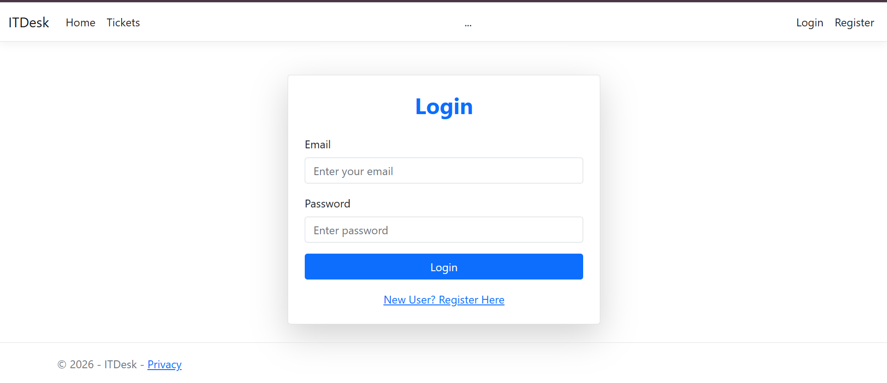
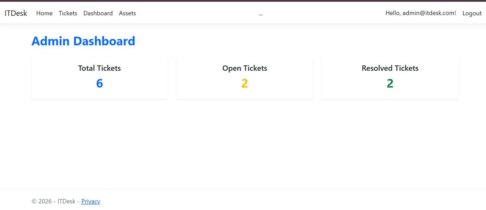
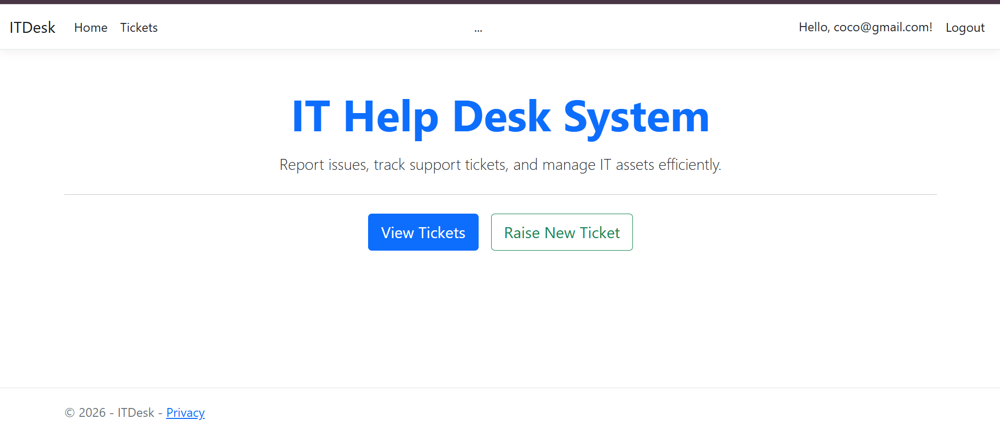
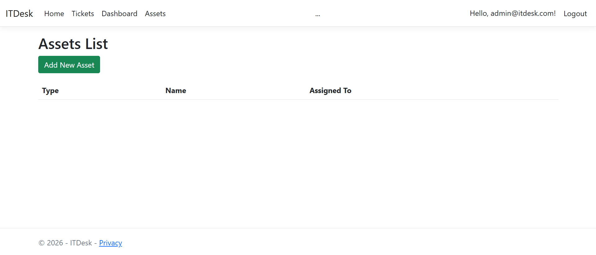

# 💻 IT Help Desk Management System

A full-featured web-based IT support system built using ASP.NET MVC and SQL Server. This application enables users to raise and track support tickets, while administrators efficiently manage issues, users, and system assets through a centralized dashboard.

---

## 🚀 Key Highlights

- 🔐 Secure authentication with password hashing
- 👥 Role-based access (Admin & User)
- 🎫 Complete ticket lifecycle management
- 🖥 Asset management by admin
- 🧩 Clean MVC architecture (scalable & maintainable)

---

## 🛠 Tech Stack

- ASP.NET MVC (C#)
- SQL Server
- Entity Framework
- Razor Views
- Bootstrap (UI Styling)

---

## ✨ Features

### 👤 User Features
- Register & Login securely
- Raise IT support tickets
- Track ticket status (Open / In Progress / Resolved)
- View complete ticket history

---

### 🔑 Admin Features
- View and manage all user tickets
- Update ticket status and resolve issues
- Manage users in the system
- 🖥 Manage system assets (add / update / delete assets)
- Dashboard overview of system activity

---

## 🔐 Security

- Passwords are securely stored using hashing techniques
- Role-based authorization implemented
- Session-based authentication for secure access

---

## 📸 Screenshots

### 🔐 Login Page

### 📊 Dashboard

### 🎫 Ticket Creation

### 🛠 Admin Panel

---

## 🔐 Demo Credentials

### Admin Access
- Email: admin@itdesk.com  
- Password: Admin@123  

### User Access
- Email: coco@gmail.com  
  Password: Coco@123  

- Email: abc@gmail.com  
  Password: Abc@123  

---

## 🚀 How to Run

1. Open Visual Studio  
2. Open `ITHelpDeskSystem.sln`  
3. Restore NuGet packages  
4. Run the project (F5)  

---

## 🗄 Database Configuration

- Configure SQL Server connection string in `appsettings.json`
- Apply migrations if required
- Database will initialize on first run (if configured)

---

## 📁 Project Structure

ITHelpDeskSystem/
  ├── Controllers/
  ├── Models/
  ├── Views/
  ├── Data/
  ├── Migrations/
  ├── wwwroot/
  └── Program.cs

---

## 🔮 Future Enhancements

- JWT-based authentication (API integration)
- Email notifications for ticket updates
- Real-time updates using SignalR
- Deployment on Azure Cloud
- Mobile-friendly UI enhancements

---

## 💡 Project Objective

To design and develop a scalable IT support system that improves issue tracking efficiency and provides a structured workflow for resolving technical problems in an organization.
